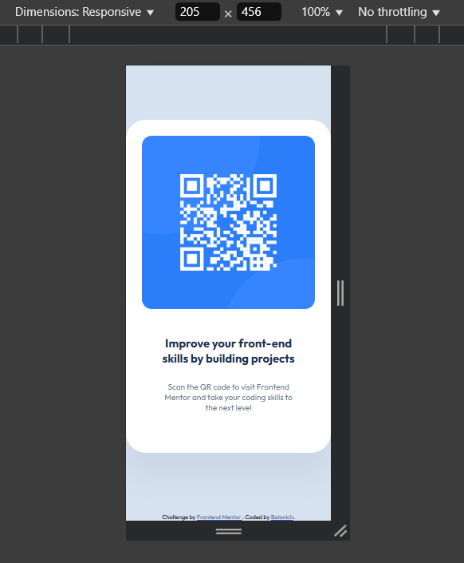

# Frontend Mentor - QR code component solution

This is a solution to the [QR code component challenge on Frontend Mentor](https://www.frontendmentor.io/challenges/qr-code-component-iux_sIO_H). Frontend Mentor challenges help you improve your coding skills by building realistic projects.

## Table of contents

- [Overview](#overview)
  - [Screenshot](#screenshot)
  - [Links](#links)
- [My process](#my-process)
  - [Built with](#built-with)
  - [What I learned](#what-i-learned)
  - [Continued development](#continued-development)
  - [Useful resources](#useful-resources)
- [Author](#author)

## Overview

### Screenshot

Large screen:


Small screen:



### Links

- Solution URL: [Github](https://github.com/Balonich/qr-code-component)
- Live Site URL: [Vercel](https://your-live-site-url.com)

## My process

### Built with

- Semantic HTML5 markup
- CSS custom properties
- Media queries
- Flexbox

### What I learned

Media queries can be also used to limit content size. For example,
```css
@media screen and (min-width: 320px) {
  .qr-code-image {
    max-width: 288px;
  }
}
```
with this code QR image will be 288px for large screens, but this `.qr-code-image` is inside the `.qr-code` block, which also has `.qr-code-text`:
```css
.qr-code {
  background-color: white;
  border-radius: 20px;
  padding: 16px 16px 40px 16px;
  max-width: fit-content;
  box-shadow: 0px 25px 25px var(--box-shadow-color);
}

.qr-code-text {
  color: var(--main-text-color);
  max-width: 288px;
  padding: 0 16px;
  text-align: center;
}
```
Without adding `max-width: 288px;` to `.qr-code-text` it will be `max-content` by default. So the actual size for `.qr-code` will be larger depending on the size of the screen and text in the `.qr-code-text`.

For the font size responsiveness, I had to work with `rem`. So [this converter](https://nekocalc.com/px-to-rem-converter) from `px` to `rem` was handy. And, by the way, base font size for `rem` units should be set in the `html` element, while at first it was inside the `body` element. Default font size is `16px`.

### Continued development

For my future projects it would be great to work more on responsiveness, focus on not using strict sizes and attributes.

### Useful resources

- [web.dev/learn/css](https://web.dev/learn/css) - This helped me to refresh and gain knowledge on CSS. Glad to it, I managed to improve accessibility and responsiveness.
- [Claude](https://claude.ai/) - Reviewed my code, pointed out what's good, what's bad and what to improve, ex. added alt-text and reduced motion preference, replaced divs with main & section

## Author

- Balonich - [Frontend Mentor](https://www.frontendmentor.io/profile/Balonich)
